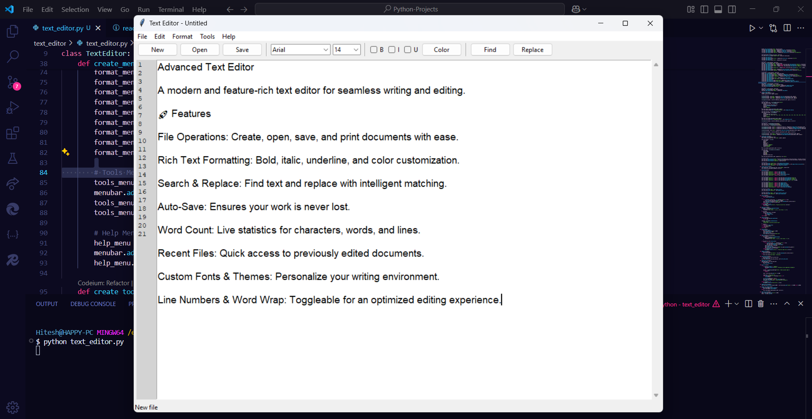

# Advanced Text Editor
  
*A modern and feature-rich text editor for seamless writing and editing.*
---
## 🚀 Features
- **File Operations**: Create, open, save, and print documents with ease.
- **Rich Text Formatting**: Bold, italic, underline, and color customization.
- **Search & Replace**: Find text and replace with intelligent matching.
- **Auto-Save**: Ensures your work is never lost.
- **Word Count**: Live statistics for characters, words, and lines.
- **Recent Files**: Quick access to previously edited documents.
- **Custom Fonts & Themes**: Personalize your writing environment.
- **Line Numbers & Word Wrap**: Toggleable for an optimized editing experience.

---

## 🛠 Installation
1. Clone the repository:
   ```bash
   git clone https://github.com/Vison-art/Python-Projects.git
   cd text-editor
   ```
2. Install dependencies (if required):
   ```bash
   pip install tk
   ```
3. Run the application:
   ```bash
   python text_editor.py
   ```
---

## 📷 Screenshot
> 

---
## 🏗 Future Enhancements
- Spell Checker
- Dark Mode
- Cloud Syncing

---
## 📜 License
This project is licensed under the MIT License.

---
*Crafted with 💻 by Hitesh*